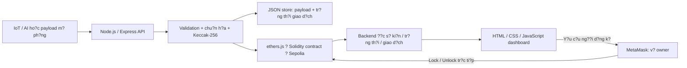

# HRC Safety Log

H? th?ng ghi nh?n s? ki?n an to?n trong c?ng t?c ng??i?robot, l?u d?u v?t tr?n Ethereum Sepolia v? hi?n th? tr?n dashboard. T?i li?u n?y h??ng d?n ch?y **contract ?? tri?n khai**, kh?ng tri?n khai l?i ho?c thay ??i ??a ch? contract.

## 1. Tr?ng th?i hi?n t?i

- Blockchain, backend v? dashboard ?? k?t n?i v?i d? li?u Sepolia th?t.
- Backend c? validation, chu?n h?a/hash payload, l?u d? li?u g?c, ch?ng g?i tr?ng, qu?n l? giao d?ch v? x?c th?c API/ch? k? thi?t b?.
- Dashboard c? k?t n?i MetaMask, ki?m tra owner, Lock/Unlock v? l?ch s? giao d?ch.
- IoT, telemetry v? m? h?nh AI th?c t? **ch?a t?ch h?p**. D? li?u c?m bi?n/AI trong c?c b?i test l? d? li?u m? ph?ng.
- LOCKED/UNLOCKED hi?n l? tr?ng th?i tr?n contract, ch?a ph?i l?nh d?ng/ch?y robot v?t l?.

## 2. Ki?n tr?c v? c?ng ngh?



| Th?nh ph?n | C?ng ngh? / tr?ch nhi?m |
|---|---|
| Backend | Node.js, Express 5, ethers 6, dotenv, CORS; API v? qu?n l? giao d?ch |
| Blockchain | Solidity 0.8.27, Hardhat 2; ghi s? ki?n, quy?n owner/operator, kh?a robot, EIP-712 |
| Frontend | HTML/CSS/JavaScript thu?n; nhi?u view trong m?t trang, kh?ng React/Vue |
| V? | MetaMask; k? giao d?ch b?ng v? ng??i d?ng tr?n Sepolia |
| L?u payload | File JSON c?c b?, kh?ng d?ng c? s? d? li?u ngo?i |
| Ki?m th? | Node.js test runner v? Hardhat |

Payload chu?n h?a ???c l?u ngo?i chain; hash v? th?ng tin s? ki?n ???c ghi tr?n chain. API ??c l?ch s? kh?ng t?i t?o ???c payload g?c n?u m?t file l?u tr?.

## 3. Th?ng tin Sepolia

| M?c | Gi? tr? |
|---|---|
| Network | Sepolia |
| Chain ID | `11155111` (`0xaa36a7`) |
| Contract | `0xF6CD683a1E46357Ae9A6e8e68D7d0094bfacd49C` |
| Deployment block | `11852711` |
| Owner l?c tri?n khai | `0xDE37CeE05cC660A73dACde0a4114A7f8c7353E9c` |
| Backend | `http://localhost:3000` |
| Frontend | `http://localhost:8080` |

Dashboard ??c `owner()` tr?c ti?p ?? x?c minh quy?n hi?n t?i; kh?ng ch? d?a v?o owner l?c tri?n khai.

- [Contract tr?n Sepolia Etherscan](https://sepolia.etherscan.io/address/0xF6CD683a1E46357Ae9A6e8e68D7d0094bfacd49C)
- [S? ki?n VIOLATION ban ??u c?a ROBOT-ARM-01](https://sepolia.etherscan.io/tx/0x5a76bc9bc52e1027735c7a40cbd020c5cfb6ea3ebe3c7f60b428a1a5272db412), block `11853429`.

## 4. C?u tr?c th? m?c

```text
hrc-safety-log/
??? README.md
??? backend/
?   ??? server.js                 # Express API
?   ??? contractConfig.js         # RPC, deployment v? ABI
?   ??? rpcProvider.js            # Request RPC ri?ng l?, kh?ng batching
?   ??? safetyService.js          # K?t n?i contract v? c?c ch?c n?ng d?ch v?
?   ??? eventPayload.js           # Validation, canonical JSON, hash, EIP-712
?   ??? eventService.js           # Ch?ng tr?ng, k?/g?i/ph?c h?i giao d?ch
?   ??? eventStore.js             # L?u payload v? tr?ng th?i giao d?ch
?   ??? apiAuth.js / adminAccess.js
?   ??? transactionHistory.js     # Safety event, Lock v? Unlock
?   ??? e2eTest.js                # Test th?t, c? g?i giao d?ch
?   ??? tests/                    # Test gi? l?p, kh?ng g?i giao d?ch Sepolia
?   ??? data/events/              # D? li?u ch?y; gi? v? sao l?u tr?n m?y backend
?   ??? INTEGRATION.md
?   ??? .env.example
?   ??? package.json / package-lock.json
??? blockchain/
?   ??? contracts/HRCSafetyLog.sol
?   ??? test/HRCSafetyLog.js
?   ??? scripts/deploy.js         # Ch? d?ng khi ch? ??ng tri?n khai contract m?i
?   ??? deployments/sepolia.json
?   ??? artifacts/                # Backend c?n ABI t? ??y
?   ??? hardhat.config.js
?   ??? package.json / package-lock.json
??? frontend/
    ??? index.html
    ??? style.css
    ??? app.js
    ??? wallet.js
    ??? vendor/                   # ethers browser bundle v? gi?y ph?p
```

## 5. Chu?n b? m?y

C?n Node.js v? npm, Python 3 ?? ph?c v? frontend, tr?nh duy?t c? MetaMask v? k?t n?i Internet. M?y ph?t tri?n hi?n t?i d?ng Node.js `v24.14.0`; ki?m tra c?ng c? tr??c khi ch?y:

```powershell
node --version
npm --version
py --version
```

C?c l?nh d??i ??y d?ng PowerShell. M? terminal t?i th? m?c g?c `hrc-safety-log`; thay ???ng d?n theo n?i b?n l?u project. Kh?ng ch?y `npm ci` t?i th? m?c g?c v? kh?ng c? `package.json` ? ??.

### 5.1. C?i dependencies

Ch?y l?n ??u tr?n m?y m?i ho?c khi nh?n project kh?ng k?m `node_modules`:

```powershell
cd blockchain
npm ci
cd ..\backend
npm ci
cd ..
```

Frontend kh?ng c?n c?i npm; th? vi?n ethers cho tr?nh duy?t ?? c? trong `frontend/vendor/`.

### 5.2. Chu?n b? ABI, kh?ng deploy

Backend c?n file:

```text
blockchain/artifacts/contracts/HRCSafetyLog.sol/HRCSafetyLog.json
```

N?u file ?? c?, b? qua b??c n?y. N?u ch?a c?, ch?y t? th? m?c g?c:

```powershell
cd blockchain
npx hardhat compile
cd ..
```

L?nh compile ch? t?o artifact tr?n m?y, kh?ng g?i giao d?ch v? kh?ng ??i contract Sepolia. L?n ??u c? th? c?n t?i compiler qua Internet. Kh?ng c?n ch?y Hardhat node ho?c `scripts/deploy.js` ?? d?ng Sepolia hi?n c?.

### 5.3. C?u h?nh backend tr?n m?y m?i

M?y ?ang ho?t ??ng: gi? nguy?n `.env`. V?i m?y m?i, t?o `backend/.env` ri?ng sau khi ki?m tra file m?u, ho?c t? t?o theo c?c t?n bi?n sau:

```dotenv
NETWORK=sepolia
RPC_URL=https://YOUR_SEPOLIA_RPC_ENDPOINT
PRIVATE_KEY=YOUR_BACKEND_SIGNING_PRIVATE_KEY
PORT=3000
```

C?c gi? tr? `YOUR_...` l? placeholder, ph?i thay b?ng c?u h?nh ri?ng. Kh?ng g?i private key qua README, chat, ZIP ho?c commit Git.

- `RPC_URL` ph?i l? RPC Ethereum Sepolia, kh?ng ph?i trang Etherscan.
- V? backend ph?i c? quy?n operator ?? ghi s? ki?n v? ETH Sepolia ?? tr? gas.
- API Unlock c?a backend y?u c?u v? k? l? owner. V? MetaMask d?ng tr?n dashboard ???c ki?m tra ??c l?p.
- `contractConfig.js` ?u ti?n ??a ch? trong `blockchain/deployments/sepolia.json`; gi? nguy?n file n?y.
- Kh?ng c?n c?u h?nh kh?a deploy trong `blockchain/.env` ?? ch? ??c contract/compile/test local. File `.env` hi?n c? v?n gi? ri?ng tr?n m?y.

Chu?n b? hai token b? m?t kh?c nhau, m?i token ?t nh?t 32 k? t?: token ingestion cho g?i s? ki?n v? token admin cho API qu?n tr?. Kh?ng s? d?ng chu?i v? d? c?ng khai l?m token th?t.

## 6. Ch?y h? th?ng

### Terminal 1 ? backend

T? th? m?c g?c:

```powershell
cd backend
$env:HRC_INGEST_API_TOKEN = Read-Host "Nhap token ingestion rieng (it nhat 32 ky tu)" -MaskInput
$env:HRC_ADMIN_API_TOKEN = Read-Host "Nhap token admin KHAC ingestion (it nhat 32 ky tu)" -MaskInput
node server.js
```

`-MaskInput` d?ng trong PowerShell 7; n?u terminal kh?ng h? tr?, d?ng `Read-Host` kh?ng c? t?y ch?n ?? trong terminal ri?ng t?. N?u token ?? ???c c?u h?nh trong m?i tr??ng backend, kh?ng c?n nh?p l?i tr??c m?i l?n kh?i ??ng trong c?ng terminal.

Ki?m tra log c? `Network: sepolia`, ??ng ??a ch? contract v? `http://localhost:3000`. M? URL backend ?? xem JSON gi?i thi?u API. Trang n?y kh?ng ph?i dashboard v? ch?a ch?ng minh RPC ?? ho?t ??ng; ki?m tra th?m `/api/events` v? robot status ? b??c 7.

### Terminal 2 ? frontend

T? th? m?c g?c:

```powershell
cd frontend
py -m http.server 8080 --bind 127.0.0.1
```

N?u kh?ng c? l?nh `py`, d?ng `python -m http.server 8080 --bind 127.0.0.1`.

M? **http://localhost:8080**. Gi? c? hai terminal ch?y. Kh?ng m? `index.html` tr?c ti?p b?ng `file://`. Khi s?a frontend, nh?n **Ctrl+F5**; khi s?a backend, Ctrl+C r?i ch?y l?i `node server.js`.

?? d?ng h? th?ng, Ctrl+C ? t?ng terminal. L?n sau ch? c?n ch?y l?i b??c 6, kh?ng c?i dependencies ho?c deploy l?i. ??ng terminal s? m?t c?c bi?n m?i tr??ng ?? nh?p b?ng `$env:...`, n?n c?n ??t l?i token tr??c khi ch?y backend.

## 7. Ki?m tra dashboard v? MetaMask

### 7.1. Ki?m tra d? li?u tr??c khi g?i giao d?ch

Trong terminal th? 3 t?i th? m?c g?c:

```powershell
Invoke-RestMethod "http://localhost:3000/api/events"
Invoke-RestMethod "http://localhost:3000/api/robots/ROBOT-ARM-01/status"
Invoke-RestMethod "http://localhost:3000/api/transactions"
```

C?c l?nh GET n?y kh?ng ti?u ETH. Robot tr?n dashboard m?c ??nh l? **ROBOT-ARM-01**; s? ki?n c?a robot kh?c v?n c? trong b?ng nh?ng kh?ng quy?t ??nh tr?ng th?i kh?a c?a robot n?y.

| Sidebar | N?i dung |
|---|---|
| Dashboard | T?ng quan, s? ki?n th?t, tr?ng th?i ROBOT-ARM-01, ?i?u khi?n owner |
| Live Monitoring | Placeholder; distance/threshold/AI prediction ch?a c? d? li?u th?t |
| Safety Events | S? ki?n ghi tr?n contract |
| Blockchain | Sepolia, chain ID, contract, deployment block |
| Transactions | SAFETY EVENT, ROBOT LOCK, ROBOT UNLOCK v? li?n k?t Etherscan |
| Robot | Tr?ng th?i robot; b?ng ?i?u khi?n Lock/Unlock n?m tr?n Dashboard |
| Settings | Th?ng tin h? th?ng; ch?a c? ?i?u khi?n c?u h?nh th?c t? |

### 7.2. K?t n?i v? v? ?i?u khi?n

1. Ch?n ??ng t?i kho?n trong MetaMask v? chu?n b? ETH test Sepolia.
2. Nh?n **Connect Wallet**; ch?p nh?n k?t n?i v? chuy?n sang Sepolia khi ???c y?u c?u.
3. Trong Robot Control, xem **Connected wallet**, **Contract owner**, **Role**. Role OWNER kh?ng ph? thu?c robot ?ang LOCKED hay UNLOCKED.
4. N?u OWNER v? robot UNLOCKED, c? th? ch?n **Emergency Stop / Lock Robot** khi c? event WARNING/VIOLATION ph? h?p.
5. N?u OWNER v? robot LOCKED, ch?n **Unlock Robot**. Dashboard c?nh b?o n?u b?n ghi g?n nh?t v?n VIOLATION.
6. X?c nh?n tr?n MetaMask. Sau khi mined, dashboard t?i l?i tr?ng th?i; xem Transactions v? li?n k?t Etherscan.

Lock th? c?ng g?i `triggerEmergencyStop(deviceId,eventId)` tr?n contract hi?n c?. Dashboard ki?m tra event ??ng robot, risk >= 2 v? quy?n operator c?a v? owner m? contract y?u c?u. Kh?ng t?o event gi? ?? kh?a. V? kh?ng ph?i owner b? ch?n c? Lock v? Unlock tr?n giao di?n.

**Gi?i h?n:** contract hi?n t?i v?n cho operator g?i Lock tr?c ti?p ngo?i dashboard; giao di?n kh?ng thu h?i quy?n blockchain ??. API admin backend c?ng gi? nguy?n quy?n token/owner ?? c?c client ri?ng s? d?ng.

Unlock kh?ng x?a b?n ghi VIOLATION v? kh?ng t? chuy?n safety state v? CLEAR. H? th?ng kh?ng t? kh?a l?i ch? v? b?n ghi c? c?n VIOLATION; c?n m?t thao t?c Lock ho?c s? ki?n risk 3 m?i. Giao d?ch ?ang pending/timeout: Refresh v? tra hash tr?n Etherscan tr??c khi th? l?i. Kh?ng g?i ??ng th?i giao d?ch t? MetaMask v? backend n?u ch?ng d?ng c?ng ??a ch? v? v? c? th? tranh nonce.

## 8. Ki?m th?

### 8.1. Ki?m th? t? ??ng, kh?ng ti?u ETH

T? th? m?c g?c:

```powershell
cd backend
npm test
cd ..\blockchain
npx hardhat test
cd ..
```

Backend tests d?ng HTTP t?m, v?/RPC gi? l?p v? d? li?u t?m; kh?ng ??c `.env` ho?c g?i giao d?ch Sepolia. Contract tests ch?y tr?n Hardhat n?i b?, kh?ng deploy l?i contract Sepolia. Trong `blockchain/`, d?ng `npx hardhat test`, kh?ng d?ng `npm test` v? script ?? ch?a ???c c?u h?nh.

B? backend tests ???c ki?m tra g?n nh?t c? 43 tr??ng h?p ??t. Kh?ng c?n ch?y test th?t ch? ?? ki?m tra giao di?n.

### 8.2. G?i m?t s? ki?n th?t ? c? ti?u ETH test

Gi? backend/frontend ch?y. T?i terminal th? 3, nh?p **??ng token ingestion ?? ??t cho backend**:

```powershell
$ingestToken = Read-Host "Nhap token ingestion cua backend" -MaskInput
$ingestHeaders = @{ Authorization = "Bearer $ingestToken" }
$sessionId = "MANUAL-" + [Guid]::NewGuid().ToString("N")
$payload = @{
    schemaVersion = "1.0"
    deviceId = "ROBOT-ARM-01"
    sessionId = $sessionId
    sequence = 1
    timestamp = [DateTimeOffset]::UtcNow.ToUnixTimeSeconds()
    sensorData = @{ distance = 0.18; speed = 0.2; force = 1.0 }
    aiResult = @{ model = "ManualTest"; state = "VIOLATION"; riskLevel = 3 }
}
$body = $payload | ConvertTo-Json -Depth 10
$result = Invoke-RestMethod -Method Post -Uri "http://localhost:3000/api/safety-event" -Headers $ingestHeaders -ContentType "application/json" -Body $body
$result
```

V? d? d?ng thi?t b? ch?a ??ng k? ch? k?. N?u ROBOT-ARM-01 ?? ???c ??ng k? tr?n contract, payload ph?i c? ch? k? EIP-712 t? signer c?a thi?t b?; xem [backend/INTEGRATION.md](backend/INTEGRATION.md). Nh?n ManualTest kh?ng ph?i AI inference th?c t?.

- HTTP 200 / `confirmed`: ?? ghi s? ki?n; risk 3 t? kh?a n?u robot ch?a kh?a.
- HTTP 202 / `pending`: gi? nguy?n `$body`, g?i l?i ch?nh y?u c?u tr?n ?? ??i so?t; kh?ng ??i session/timestamp/sequence.
- G?i l?i ??ng payload sau khi confirmed: tr? k?t qu? tr?ng, kh?ng t?o giao d?ch ghi m?i.
- Thay n?i dung nh?ng gi? c?ng danh t?nh event: b? t? ch?i conflict (409).
- Khi t?o ph?p ?o m?i: d?ng sequence m?i ho?c session m?i. Kh?ng d?ng danh t?nh ?? g?i cho payload kh?c.

Nh?n Refresh Data tr?n dashboard, ki?m tra ROBOT-ARM-01 LOCKED v? event m?i. Sau ?? th? Unlock b?ng MetaMask, r?i Lock l?i b?ng event v?a ghi n?u c?n. M?i giao d?ch k?/g?i th?t c? ph? gas; ch? xem, k?t n?i v? v? Refresh kh?ng c? ph? gas.

| Risk | Nh?n dashboard | H?nh vi kh?a |
|---|---|---|
| 0 | CLEAR | Kh?ng t? kh?a, kh?ng t? m? kh?a |
| 1 | LOW | Kh?ng t? kh?a, kh?ng t? m? kh?a |
| 2 | WARNING | Kh?ng t? kh?a; c? th? l?m c?n c? Lock th? c?ng |
| 3 | VIOLATION | T? kh?a khi ghi s? ki?n n?u ch?a kh?a |

### 8.3. Script test t?ch h?p t?y ch?n

T? terminal ri?ng, th? m?c `backend`, ??t `$env:HRC_INGEST_API_TOKEN` b?ng token c?a backend r?i ch?y:

```powershell
node e2eTest.js
```

Script g?i b?n m?c risk cho c?c robot `E2E-ROBOT-SAFE`, `E2E-ROBOT-LOW`, `E2E-ROBOT-WARNING`, `E2E-ROBOT-DANGER`. N? ti?u ETH test c?a v? backend v? kh?ng thay tr?ng th?i c?a ROBOT-ARM-01. Kh?ng ch?y ??ng th?i v?i giao d?ch kh?c t? c?ng v? k?.

## 9. API hi?n c?

| Method / endpoint | Quy?n | M?c ??ch |
|---|---|---|
| `GET /` | C?ng khai | Gi?i thi?u backend |
| `GET /api/events` | C?ng khai | T?t c? safety events |
| `GET /api/events/:eventId` | C?ng khai | Chi ti?t m?t event |
| `GET /api/transactions` | C?ng khai | L?ch s? ghi event, Lock, Unlock |
| `GET /api/robots/:deviceId/status` | C?ng khai | LOCKED/UNLOCKED |
| `POST /api/safety-event` | Bearer ingestion token | Validation, l?u payload/hash, ghi contract |
| `GET /api/admin/access` | Bearer admin token | Ki?m tra v? backend l? owner |
| `POST /api/robots/:deviceId/unlock` | Bearer admin token + v? backend owner | Unlock qua backend |
| `GET /api/events/:eventId/payload` | Bearer admin token | Payload ?? l?u v? ki?m tra hash |

Dashboard Lock/Unlock k? tr?c ti?p qua MetaMask; kh?ng c? API backend Lock m?i. Xem chu?n payload, ch? k? EIP-712 v? recovery chi ti?t trong [INTEGRATION.md](backend/INTEGRATION.md). Ph?n m? t? MetaMask ch?a tri?n khai ? ??u t?i li?u ?? l? ghi ch? c?; h??ng d?n dashboard trong README n?y v? ph?n cu?i t?i li?u ph?n ?nh phi?n b?n hi?n t?i.

## 10. L?u d? li?u v? l?m vi?c nh?m

- `backend/data/events/` gi? payload g?c, hash, giao d?ch ?? k? v? tr?ng th?i ph?c h?i. Sao l?u, kh?ng x?a khi d?n project v? kh?ng x?a writer lock khi backend c?n ch?y.
- M?i store ch? c? m?t backend writer. Kh?ng cho nhi?u m?y c?ng ghi b?ng c?ng v? k?; nh?m n?n d?ng m?t backend chung ho?c ph?i h?p th?i ?i?m g?i.
- L?ch s? Sepolia ??c ???c tr?n m?y m?i; payload ngo?i chain ch? ??c ???c n?u m?y ?? c? store t??ng ?ng. Event c? kh?ng c? archive c? th? tr? l?i khi truy v?n payload.
- G?i source g?i nh?m: gi? frontend/vendor, source backend/blockchain, tests, docs, package files, deployment Sepolia. Gi? artifact c?n thi?t ho?c h??ng d?n compile tr??c khi ch?y.
- Kh?ng g?i `.env`, token, private key, c?m kh?i ph?c v?, `backend/data/` ho?c `node_modules/` trong g?i m? ngu?n. Th?nh vi?n c?i dependencies v? c?u h?nh ri?ng.
- Ch? v? owner hi?n t?i ???c Lock/Unlock tr?n dashboard; k?t n?i m?t v? m?i kh?ng t? c?p quy?n owner/operator.

## 11. X? l? l?i th??ng g?p

| Tri?u ch?ng | Ki?m tra / x? l? |
|---|---|
| `localhost:8080` kh?ng truy c?p ???c | Ch?y HTTP server t? th? m?c frontend; backend kh?ng t? ph?c v? c?ng 8080 |
| `localhost:3000` kh?ng truy c?p ???c | Ch?y `node server.js` t? th? m?c backend; ki?m tra log v? c?ng |
| Thi?u `HRCSafetyLog.json` | Ch?y `npx hardhat compile` trong blockchain, kh?ng deploy |
| `PRIVATE_KEY is missing` | C?u h?nh backend tr?n m?y ri?ng, kh?i ??ng ??ng th? m?c; kh?ng chia s? gi? tr? kh?a |
| `AUTH_NOT_CONFIGURED` | ??t token >= 32 k? t?, hai token kh?c nhau trong process backend r?i kh?i ??ng l?i |
| `UNAUTHORIZED` | D?ng ??ng lo?i token v? header Bearer; token ? terminal test ph?i kh?p backend |
| MetaMask kh?ng hi?n popup | M? extension ki?m tra request ?ang ch?, t?i kho?n, quy?n website; Ctrl+F5 n?u frontend c? |
| Role READ ONLY / NOT VERIFIED | Ki?m tra ??a ch? owner, t?i kho?n MetaMask v? m?ng Sepolia; UNLOCKED kh?ng l?m m?t quy?n owner |
| Lock b? v? hi?u h?a | C?n owner, robot UNLOCKED, d? li?u ?? t?i v? event risk >= 2 c?a ROBOT-ARM-01 |
| Owner kh?ng Lock ???c | Contract c?n y?u c?u v? n?m trong operators; dashboard b?o l?i tr??c khi g?i |
| `missing response for request` | Ki?m tra RPC v? kh?i ??ng l?i backend b?n m?i; rpcProvider ?? t?t batching |
| Pending / timeout | Tra hash, Refresh; v?i API ingestion gi? nguy?n payload ?? retry, kh?ng t?o event thay th? |
| `insufficient funds` | N?p ETH **Sepolia** v?o ??ng v? tr? gas; ETH tr?n m?ng kh?c kh?ng d?ng thay th? |
| UNKNOWN tr?n dashboard | Xem th?ng b?o API, th? GET events/status ? terminal, ki?m tra RPC; kh?ng m?c ??nh robot an to?n |

D? li?u th?t v? placeholder ???c ph?n bi?t tr?n dashboard. Vi?c hi?n th? LIVE ch?a c? ngh?a telemetry IoT ho?c d? ?o?n AI ?? ???c k?t n?i.
